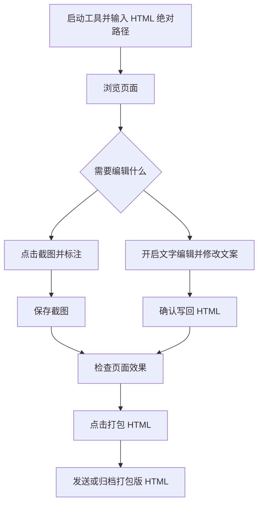

# HTMLeditor 交互文档

## 1. 产品定位

HTMLeditor 是一个本地运行的 HTML 辅助编辑工具，用于在不改动原页面代码结构的前提下，对 HTML 页面中的截图和文字做快速编辑，并可导出不依赖本地资源的打包版 HTML。

工具通过本地服务启动。用户输入目标 HTML 的绝对路径后，服务读取该 HTML，在浏览器响应中临时注入工具栏、截图编辑器和文字编辑能力。工具脚本不会写入原 HTML。

## 2. 使用角色

| 角色 | 主要目标 |
| --- | --- |
| 文档编写者 | 给用户手册截图加红框、备注，修正文案，导出可发送版本 |
| 产品/运营 | 快速调整操作说明、截图标注和演示材料 |
| 审阅者 | 查看已打包的自包含 HTML，无需本地素材目录 |

## 3. 启动入口

### 3.1 双击启动

用户双击 `启动网页标注工具.command` 后，系统弹出输入框：

- 标题：请输入要标注的 HTML 文件绝对路径
- 默认值：工具目录下的示例 HTML 路径
- 按钮：启动

用户点击“启动”后：

1. 校验输入路径是否存在。
2. 使用 `127.0.0.1` 启动本地服务。
3. 自动打开 `http://127.0.0.1:8765/<HTML文件名>`。
4. 页面运行时注入工具能力。

路径不存在时，显示系统弹窗“文件不存在”，并退出启动流程。

### 3.2 命令行启动

```bash
node manual-annotator-server.mjs "/absolute/path/to/your.html"
```

默认端口为 `8765`。如需指定端口：

```bash
PORT=8877 node manual-annotator-server.mjs "/absolute/path/to/your.html"
```

## 4. 页面注入逻辑

工具启动后，页面会新增以下入口：

| 入口 | 显示位置 | 说明 |
| --- | --- | --- |
| 打包 HTML | 页面 `.topbar` 内；若页面无 `.topbar`，显示在右上角浮动工具条 | 生成自包含 HTML |
| 编辑文字 | 同上 | 开启或关闭正文文字编辑模式 |
| 截图编辑器 | 点击页面图片后弹出 | 用于框选、文字备注、保存图片 |

注入只发生在本地服务返回给浏览器的 HTML 中，不会写回源 HTML。

## 5. 截图标注流程

### 5.1 打开截图编辑器

用户点击页面中的图片后，弹出全屏截图编辑器。

编辑器顶部显示：

- 当前图片路径
- 框选
- 文字
- 备注文字输入框
- 缩小
- 放大
- 上一步
- 应用到当前截图
- 关闭

底部显示图片版本历史区。

### 5.2 框选

1. 点击“框选”。
2. 鼠标在图片上按下并拖拽。
3. 松开鼠标后生成红色矩形框。
4. “应用到当前截图”按钮变为可用。

### 5.3 文字备注

1. 点击“文字”。
2. 在备注文字输入框中输入内容。
3. 点击图片中的目标位置。
4. 系统在该位置生成红色底白字备注。
5. “应用到当前截图”按钮变为可用。

### 5.4 放大与缩小

- 点击“放大”提高画布缩放比例。
- 点击“缩小”降低画布缩放比例。
- 鼠标滚轮也可调整缩放。

缩放只影响编辑视图，不改变原图尺寸。

### 5.5 上一步

点击“上一步”后，撤销最近一次框选或文字备注。

快捷键：

```text
Command/Ctrl + Z
```

### 5.6 保存图片

点击“应用到当前截图”后：

1. 服务校验图片路径必须在当前 HTML 所在目录内。
2. 自动保存当前图片的历史版本。
3. 将标注后的 PNG 写回原图片路径。
4. 再保存一份“保存状态”历史版本。
5. 页面内当前图片刷新。
6. Toast 提示“已替换当前截图”。

如果当前没有新增标注，点击保存时提示：

```text
当前没有新的标注，不需要保存。
```

## 6. 图片版本历史

### 6.1 历史展示

打开截图编辑器后，底部展示当前图片的历史版本：

- 初始状态
- 保存前
- 保存状态
- 当前状态

历史文件保存在目标 HTML 所在目录：

```text
assets/manual-history/
```

### 6.2 切换预览

用户点击任意历史缩略图后：

1. 缩略图高亮。
2. 编辑区切换显示该版本图片。
3. “恢复此版本”按钮变为可用。

切换预览不会立即覆盖原图。

### 6.3 恢复版本

1. 选择一个历史版本。
2. 点击“恢复此版本”。
3. 系统弹出确认框。
4. 点击“确认”后，历史版本覆盖当前原图。
5. 页面内图片刷新。

恢复历史版本不会额外保存恢复前状态。

### 6.4 清空历史

1. 点击“清空历史”。
2. 系统弹出确认框。
3. 点击“确认”后删除该图片的历史目录。
4. 系统重新生成当前图片的初始历史。

## 7. 文字编辑流程

### 7.1 开启文字编辑

点击“编辑文字”后：

- 按钮进入激活状态。
- 正文可编辑文本区域鼠标样式变为文本编辑。
- Toast 提示“文字编辑已开启。点击正文文字进行编辑。”

再次点击“编辑文字”则关闭该模式。

### 7.2 编辑单段文字

1. 开启文字编辑模式。
2. 点击正文中的标题、段落、表格文字或截图说明。
3. 系统在该文字下方插入编辑框。
4. 修改内容。
5. 点击“确认”。

确认后：

1. 页面中的文字立即更新。
2. 服务在目标 HTML 中定位原文字。
3. 写回新的文字内容。
4. Toast 提示“文字已保存到 HTML。”

点击“取消”则关闭编辑框，不做保存。

### 7.3 不保存场景

以下情况不会写回 HTML：

- 输入为空。
- 输入内容与原文一致。
- 点击“取消”。
- 未通过本地服务打开页面。

未连接本地服务时，页面文字可能只在当前浏览器中临时变化，并提示：

```text
文字只改了当前页面，未写回 HTML。请确认本地服务正在运行。
```

## 8. 一键打包 HTML

### 8.1 入口

点击页面顶部或浮动工具条中的“打包 HTML”。

### 8.2 打包行为

系统执行以下动作：

1. 读取当前目标 HTML。
2. 移除运行时注入的工具 CSS 和 JS 引用。
3. 查找 HTML 中的本地图片引用。
4. 将图片转为 `data:image/...;base64`。
5. 查找 `<style>` 中的本地 `url(...)` 图片引用。
6. 将可读取的本地图片转为 data URL。
7. 生成新文件：

```text
原文件名-打包版.html
```

### 8.3 打包结果

打包成功后，Toast 显示：

```text
已生成：xxx-打包版.html
```

打包版 HTML 可以脱离原图片目录打开和发送。

### 8.4 打包限制

以下资源不会被内联：

- 远程 URL，例如 `https://...`
- `blob:` 资源
- 已经是 `data:` 的资源
- 当前 HTML 所在目录之外的文件
- 非图片类 CSS/JS 外链

## 9. 异常与提示

| 场景 | 提示 | 处理建议 |
| --- | --- | --- |
| 启动路径不存在 | 文件不存在 | 检查 HTML 绝对路径 |
| 图片保存失败 | 没有连接到本地标注服务，暂时不能直接替换原图 | 使用本地服务 URL 打开页面 |
| 图片路径不合法 | 只能替换当前 HTML 所在目录下的 PNG 图片 | 确认图片在 HTML 同目录或子目录下 |
| 文字定位失败 | 未找到要替换的文字 | 刷新页面后重试，避免同时改动重复文案 |
| 打包失败 | 打包失败或具体错误信息 | 检查图片文件是否存在、路径是否在 HTML 所在目录内 |

## 10. 数据写入规则

| 操作 | 写入位置 | 是否覆盖原文件 |
| --- | --- | --- |
| 保存截图标注 | 原图片路径 | 是 |
| 保存文字 | 当前目标 HTML | 是 |
| 恢复图片历史 | 原图片路径 | 是 |
| 清空图片历史 | `assets/manual-history/` | 删除历史后重建 |
| 打包 HTML | `原文件名-打包版.html` | 否 |

## 11. 安全边界

- 服务只监听 `127.0.0.1`。
- 静态文件访问被限制在目标 HTML 所在目录内。
- 图片写回限制在目标 HTML 所在目录内。
- 工具注入只存在于服务响应中。
- 打包功能生成新文件，不覆盖原 HTML。

## 12. 推荐操作顺序


